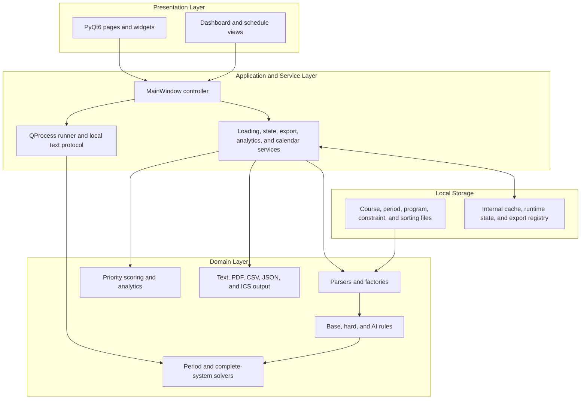
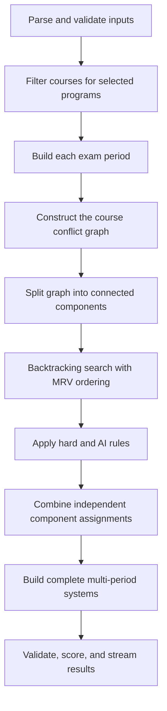

# ExamScheduler

<p align="center">
  
</p>

<p align="center">
  <strong>Offline university exam scheduling, validation, analysis, and calendar integration.</strong>
</p>

<p align="center">
  Final application release: <strong>3.4.2</strong> · Python 3.10–3.13 · PyQt6 · Windows 10/11 x64
</p>

ExamScheduler is a standalone desktop and command-line application for building valid university exam schedules from course catalogs, exam periods, and selected study programs. It combines an exact constraint-based scheduling engine with a responsive PyQt6 interface, deterministic schedule ranking and analytics, RFC 5545 calendar export, and an optional local AI Copilot for translating natural-language requests into validated scheduling rules.

The application is designed for offline institutional use. Scheduling, analytics, persistence, and AI inference remain on the local computer; no cloud service or web backend is required.

> **Release status:** The Windows installer is version **3.4.2**, as declared in `packaging/ExamSchedulerDualModel.iss`. The most recent repository tag is the earlier `v2.0.0` milestone; the final 3.4.2 implementation is the current `Develop` release snapshot and includes all Stage 3 and final-release features documented here.

## Table of Contents

- [Key Capabilities](#key-capabilities)
- [System Workflow](#system-workflow)
- [Scheduling Rules and Constraints](#scheduling-rules-and-constraints)
- [Schedule Ranking](#schedule-ranking)
- [Local AI Copilot](#local-ai-copilot)
- [Analytics Dashboard and Reports](#analytics-dashboard-and-reports)
- [Calendar Integration](#calendar-integration)
- [Architecture](#architecture)
- [Scheduling Algorithm](#scheduling-algorithm)
- [Installation](#installation)
- [Quick Start from Source](#quick-start-from-source)
- [Desktop Usage](#desktop-usage)
- [Command-Line Interface](#command-line-interface)
- [Input and Output Files](#input-and-output-files)
- [Testing and Quality Assurance](#testing-and-quality-assurance)
- [Project Structure](#project-structure)
- [Privacy and Security](#privacy-and-security)
- [Troubleshooting](#troubleshooting)
- [Documentation](#documentation)
- [Project Team](#project-team)
- [License](#license)

## Key Capabilities

### End-to-end desktop workflow

- Load course and exam-period files in **replace** or **update** mode.
- Recover the last valid source paths and parsed data from a local cache.
- Detect changed, stale, missing, or corrupt source data and reload safely.
- Select up to five study programs and inspect their courses by year and semester.
- Edit exam-period boundaries and exclude or restore individual calendar days.
- Configure five optional hard scheduling constraints with validated threshold values.
- Generate schedules without blocking the interface.
- Cancel an active generation process, including its child process tree.
- Review schedules as calendar views with lazy pagination.
- Change ranking priorities while schedules are available.
- Track the best schedule found across generated batches.
- Save the selected schedule as readable text or deterministic analytics.
- Synchronize a selected schedule with calendar applications through `.ics` files.

### Exact and scalable scheduling

- Generates valid schedules for an individual exam period or a complete multi-period system.
- Uses a conflict graph, connected-component decomposition, backtracking, and minimum-remaining-values ordering.
- Counts the complete solution space without materializing every complete system.
- Streams complete schedules lazily in pages of 1,000 systems.
- Uses bounded in-memory buffers, compact assignment storage, spill-to-disk support, and format caches for large searches.
- Supports bounded output by maximum system count or runtime limit.
- Preserves compatibility with the original V1 file-based workflow while serving the V2/V3 desktop application.

### Operational and reporting features

- Deterministic dashboard metrics, cohort diagnostics, density charts, and bottleneck insights.
- Analytics exports in JSON, text, CSV, and PDF formats.
- Configurable multi-criteria schedule ordering.
- RFC 5545 calendar publishing and cancellation, including Hebrew-safe labels and Outlook compatibility.
- Persistent registry of previously exported calendar events.
- Fully local AI-assisted rule creation with confirmation, validation, persistence, and reversal.
- Offline Windows packaging with embedded Python, local dependencies, Ollama, and selectable AI models.

## System Workflow


The desktop application exposes five primary pages:

| Page | Purpose |
| --- | --- |
| **Dashboard** | Displays analytics for the overall best schedule and the current generated batch. |
| **Programs** | Loads data, selects study programs, inspects program courses, and hosts the AI Copilot. |
| **Calendar** | Displays exam periods and allows period-boundary edits and day exclusions. |
| **Settings** | Enables and validates the five optional threshold constraints. |
| **Schedules** | Displays generated systems, pagination, ranking, saving, analytics, and calendar actions. |

During generation, the application switches to a full-screen loading view with progress messages and cancellation controls. The solver runs in a child process so the UI event loop remains responsive.

## Scheduling Rules and Constraints

### Base academic conflict rule

Two exams cannot be placed on the same date when they belong to the same study program and year and at least one course is mandatory. Two elective courses in the same cohort may share a date unless a stricter optional constraint disallows that result.

### Optional hard constraints

Each hard constraint may be enabled independently in **Settings** or supplied through the file-based CLI workflow. A schedule that violates an enabled constraint is rejected.

| Requirement | Runtime key | Rule | Valid threshold |
| --- | --- | --- | --- |
| 2.1 | `min_days_between_mandatory` | Minimum calendar-day gap between mandatory exams in the same program and year. | Integer `k ≥ 1` |
| 2.2 | `min_days_between_any` | Minimum calendar-day gap between any two exams in the same program and year. | Integer `k ≥ 1` |
| 2.3 | `max_elective_conflicts` | Maximum number of same-day elective conflicts per program. | Integer `k ≥ 0` |
| 2.4 | `min_days_before_last_mandatory` | Minimum span between the first and last mandatory exams for a program/year/term. | Integer `k ≥ 1` |
| 2.5 | `max_exams_per_day` | Maximum number of exams assigned to one date. | Integer `k ≥ 1` |

Calendar-day gaps include weekends and holidays. Constraint validation is centralized so desktop inputs, file inputs, and AI-proposed values follow the same rules.

## Schedule Ranking

Valid schedules can be ranked lexicographically using any enabled subset of the following criteria. Users may enable, disable, and reorder the criteria from the schedule sorting panel without regenerating the underlying solutions.

| Priority key | Display name | Measurement |
| --- | --- | --- |
| `mandatory_min_gap` | Mandatory min gap | Minimum gap between mandatory exams for shared cohorts. |
| `average_cohort_gap` | Average cohort gap | Average gap between exams for the same program/year cohort. |
| `elective_conflicts` | Elective conflicts | Number of same-day elective collision pairs. |
| `mandatory_span` | Mandatory span | Span between the first and last mandatory exam. |
| `max_daily_exams` | Max daily exams | Highest number of exams placed on a single date. |

The configured order is significant: the first active metric is compared first, followed by the next metric only when higher-priority values are tied. The same priority definition drives result ordering, best-schedule tracking, dashboard explanations, and analytics exports.

## Local AI Copilot

The AI Copilot converts plain-English scheduling requests into a strict, validated rule schema. It is an interface to the existing constraint engine; it does not replace the deterministic scheduler and cannot directly edit application data.

### Supported requests

| Action | Example |
| --- | --- |
| Fix a course to one date | `Schedule Physics on 2026-07-15` |
| Exclude a date or weekday | `No exams on Fridays` |
| Exclude a month or date range | `No exams between 2026-07-01 and 2026-07-10` |
| Mark lecturer unavailability | `Professor Cohen is unavailable on 2026-07-15` |
| Limit daily exams for a program | `Limit program 83101 to 2 exams a day` |
| Set a global exam gap | `Keep at least 3 days between exams` |
| Revert a Copilot-created rule | `Allow exams on Fridays` |
| Inspect supported or active rules | Ask what rules are supported or currently active. |

### Safety and lifecycle

1. The request is sanitized and checked against an allowlist.
2. A local Ollama model returns a JSON-only proposal.
3. The proposal is schema-validated and checked against loaded courses, programs, periods, and existing rules.
4. The user reviews and confirms the change.
5. Only the confirmed rule is persisted and passed to the solver.

AI inference fails closed: malformed output, unsupported requests, injection patterns, unavailable models, insufficient memory, or timeouts do not change scheduling rules. Base rules and manually configured constraints cannot be removed by the chatbot. Copilot-created rules use scoped `ai_rule_*` identifiers and can be reverted safely.

The Copilot accepts concise English ASCII requests. The packaged release supports these local models:

- **Recommended:** `llama3.1:8b-instruct-q4_K_M`
- **Lightweight:** `qwen3:4b`

The model can be selected with `EXAMSCHEDULER_OLLAMA_MODEL`; a custom Ollama executable can be supplied with `EXAMSCHEDULER_OLLAMA_PATH`. The default inference timeout is 30 seconds, and scheduling remains fully usable when AI is unavailable.

## Analytics Dashboard and Reports

Analytics are deterministic: every value is calculated from a generated schedule and the active ranking priorities. The analytics engine does not call the AI model.

The dashboard includes:

- overall-best and current-batch schedule summaries;
- active priority values and fitness explanation;
- minimum study-gap information;
- daily exam-density charts;
- busiest-day and cohort-collision indicators;
- program/year cohort matrices;
- mandatory/elective distribution and gap measurements;
- deterministic bottleneck diagnostics;
- comparison with the previous overall-best schedule;
- a notification when a new overall best is found.

Reports can be exported as:

- **JSON** for structured processing;
- **TXT** for human-readable review;
- **CSV** for spreadsheet analysis;
- **PDF** for formal distribution and printing.

PDF generation includes high-scale pagination and boundary handling. Analytics can be exported from the selected desktop schedule or automatically after a CLI file-writing run.

## Calendar Integration

The selected schedule can be exported as an RFC 5545 `.ics` calendar file.

- Publishes dated exams as calendar events.
- Stores stable event information in a local export registry.
- Cancels events that were present in the previous export but are absent from the newly selected schedule.
- Can generate a global cancellation file for all previously exported ExamScheduler events.
- Supports mixed `CONFIRMED` and `CANCELLED` events in one calendar payload.
- Uses compliant UTF-8 line folding and safe escaping.
- Preserves full course information while shortening month-view labels when required.
- Handles Hebrew course names and Outlook-specific interoperability requirements.

The application generates the `.ics` file; the user opens or imports it with the local calendar application. No calendar account credentials are requested or stored.

## Architecture

ExamScheduler follows a layered, object-oriented design. UI components collect intent and display state; application services coordinate operations; domain modules perform parsing, validation, scheduling, ranking, and output generation.



### Process boundary

Long-running work is never executed directly by a widget. `src/ui/process_runner.py` launches `main.py` through `QProcess` and translates stdout, stderr, completion, and failure events into Qt signals.

Lazy paging uses a small local stdin/stdout protocol:

```text
NEXT
STOP
__EXAM_SCHEDULER_BATCH_END__
```

- `NEXT` requests another schedule page.
- `STOP` ends or cancels the current lazy stream.
- `__EXAM_SCHEDULER_BATCH_END__` marks a complete generated batch.

There is no HTTP server, socket API, or remote scheduling backend.

## Scheduling Algorithm



For each period, the solver builds valid dates and a conflict graph, decomposes independent components, and uses backtracking with minimum-remaining-values ordering. Component assignments are combined to form period schedules.

For a complete system, period schedule sets form a Cartesian product. The exact total is therefore:

```text
complete_system_count = period_1_count × period_2_count × ... × period_n_count
```

The product can be counted without expanding every result. When schedules are requested, the solver streams them incrementally and applies bounded storage and formatting caches instead of retaining an unbounded materialized list.

## Installation

### Final Windows release

The supported end-user package is the **ExamScheduler 3.4.2 offline installer** for Windows 10/11 x64. The installer is built as a multi-part Inno Setup package because the selected local AI model can be several gigabytes.

The installer:

- installs under `%LOCALAPPDATA%\ExamScheduler` without administrator privileges;
- deploys an embedded Python runtime and runtime packages;
- installs the desktop launcher and optional shortcut;
- includes local Ollama binaries;
- offers the recommended Llama model, lightweight Qwen model, or both;
- configures local model storage without downloading content on the target computer.

Keep all installer `.exe` and `.bin` parts in the same directory, run the setup executable, choose the desired model configuration, and launch ExamScheduler from the created shortcut.

For release engineering and bundle verification, see [docs/offline_packaging.md](docs/offline_packaging.md).

### Runtime requirements when installing from source

- Python 3.10–3.13
- PyQt6 6.7 or later
- ReportLab 4.0 or later
- Windows 10/11 for the supported packaged workflow
- Optional: Ollama with a supported local model for AI Copilot functionality

## Quick Start from Source

Run all commands from the repository root.

### 1. Create a virtual environment

```powershell
python -m venv .venv
.\.venv\Scripts\Activate.ps1
```

### 2. Install dependencies

For development and testing:

```powershell
python -m pip install --upgrade pip
python -m pip install -r requirements.txt
```

For runtime-only installation:

```powershell
python -m pip install -r requirements-runtime.txt
```

### 3. Launch the desktop application

```powershell
python gui_main.py
```

The repository includes sample input files in `data/`, and the application attempts to load the configured defaults automatically.

### 4. Optional: enable the AI Copilot

Install Ollama, make a supported model available locally, and optionally select it before launching:

```powershell
$env:EXAMSCHEDULER_OLLAMA_MODEL = "llama3.1:8b-instruct-q4_K_M"
python gui_main.py
```

If Ollama is not installed or the model cannot run, the rest of ExamScheduler continues to operate normally.

## Desktop Usage

1. Open **Programs** and confirm the course and exam-period file paths.
2. Choose **Replace** to start from the selected file or **Update** to merge new data with the current loaded state.
3. Select up to five study programs. Click a selected program to inspect its courses.
4. Open **Calendar** to review periods, change their start/end dates, or exclude unavailable days.
5. Open **Settings** to enable optional hard constraints and enter valid threshold values.
6. Optionally ask the **AI Copilot** for a supported scheduling rule, review the proposal, and confirm it.
7. Return to **Programs** and select **Generate Schedules**.
8. Monitor progress or cancel from the loading screen.
9. Open **Schedules** to page through results and configure ranking priorities.
10. Use **Dashboard** to inspect the best schedule, density, cohort pressure, and comparison insights.
11. Save the selected schedule, export analytics, or create an `.ics` calendar synchronization file.

## Command-Line Interface

Display the complete option reference:

```powershell
python main.py --help
```

### Execution modes

| Mode | Purpose |
| --- | --- |
| `period` | Generate and write schedules for selected individual periods. |
| `complete-count` | Count all complete systems without writing every result. |
| `complete-write` | Write complete systems, optionally bounded by `--max-systems`. |
| `auto` | Count the complete space and write or stream results within configured limits. |

### Common examples

Count the full solution space:

```powershell
python main.py --mode complete-count
```

Generate selected zero-based period indexes:

```powershell
python main.py --mode period --period-index 0 --period-index 1
```

Write at most 1,000 complete systems:

```powershell
python main.py --mode complete-write --max-systems 1000
```

Run automatic generation with a 30-second output limit:

```powershell
python main.py --mode auto --time-limit 30
```

Override the default input files:

```powershell
python main.py --mode auto `
  --course-file "path\to\courses.txt" `
  --dates-file "path\to\exam-dates.txt" `
  --user-file "path\to\programs.txt"
```

Apply file-based constraints and ranking priorities:

```powershell
python main.py --mode auto `
  --constraints-file "path\to\constraints.txt" `
  --sorting-file "path\to\sorting-priority.txt"
```

Write schedules and export analytics in multiple formats:

```powershell
python main.py --mode complete-write `
  --max-systems 100 `
  --export-analytics `
  --analytics-format json,csv,pdf.`
  --analytics-output-dir "outputs\analytics" `
  --analytics-base-filename "final_schedule_report"
```

Stream schedules for a local caller:

```powershell
python main.py --mode auto --stream-schedules
```

Start the interactive lazy stream used by the desktop UI:

```powershell
python main.py --mode auto --lazy-schedules
```

Validated AI rules may also be provided with `--ai-rules-file`, `--ai-constraint-json`, or `--ai-constraint-json-file`. Use `--export-ai-constraint-file` to write a validated AI rule payload for the file-based workflow.

## Input and Output Files

### Default configuration

`config.json` defines the default source and output locations:

```json
{
  "source_type": "file",
  "file": {
    "course_file": "data/V1.0CourseDB.txt",
    "dates_file": "data/V1.0 ExamDates.txt",
    "user_file": "data/Programs.txt"
  },
  "output_settings": {
    "base_directory": "outputs",
    "master_filename": "university_master_schedule"
  }
}
```

### Supported inputs

| File | Purpose |
| --- | --- |
| `V1.0CourseDB.txt` | Course identifiers, names, lecturers, assessment data, and program/year affiliations. |
| `V1.0 ExamDates.txt` | Semester/term periods, start and end dates, and excluded dates. |
| `Programs.txt` | A comma-separated selection of one to five five-digit program identifiers. |
| Constraint file | Optional threshold settings for requirements 2.1–2.5. |
| Sorting file | Optional ordered list of ranking criteria. |
| AI rules JSON | Optional validated active Copilot rules. |

Text inputs are read as UTF-8 with optional BOM support. Exam dates use `DD-MM-YYYY` in the legacy input format; AI rule dates use ISO `YYYY-MM-DD`.

### Generated local data

Depending on the selected workflow, ExamScheduler may create:

- readable schedule output under `outputs/`;
- UI runtime input files and streamed schedule state;
- deterministic JSON, TXT, CSV, or PDF analytics;
- RFC 5545 `.ics` files;
- a local parsed-input cache and source fingerprints;
- an exported-calendar registry;
- active AI rule state;
- local performance and resource logs.

Generated runtime directories are intentionally excluded from version control.

## Testing and Quality Assurance

Install the development dependencies and run the complete suite:

```powershell
python -m pytest -q
```

The suite covers:

- parser validation and legacy V1 compatibility;
- academic models and enums;
- base, spacing, advanced, and AI rule behavior;
- period-solver and complete-system correctness;
- exact counting, lazy streaming, memory bounds, and stress behavior;
- workflow and CLI integration;
- deterministic ranking and analytics exporters;
- PDF high-scale boundaries;
- ICS validity, UTF-8 folding, Hebrew text, and Outlook compatibility;
- cache staleness, corruption recovery, and version handling;
- PyQt widget behavior, responsive layouts, and loading/cancellation states;
- local process boundaries and process-tree cleanup;
- AI adversarial input, resource pressure, timeouts, and fail-closed behavior;
- architecture import direction and network isolation.

Useful focused commands:

```powershell
python -m pytest tests\solver -q
python -m pytest tests\ui -q
python -m pytest tests\analytics -q
python -m pytest tests\architecture -q
```

The current pytest result is the authoritative test count; the documentation intentionally avoids a hard-coded number that can become stale.

## Project Structure

```text
ExamScheduler/
├── gui_main.py                 Desktop entry point
├── main.py                     CLI entry point and workflow dispatcher
├── config.json                 Default source and output configuration
├── data/                       Sample/default input files and AI rule state
├── src/
│   ├── analytics/              Deterministic metrics and report exporters
│   ├── models/                 Academic and scheduling domain models
│   ├── output/                 Text and ICS formatting
│   ├── parser/                 Legacy-compatible file parsers and factories
│   ├── rules/                  Base, hard-constraint, and AI scheduling rules
│   ├── services/               Application coordination and persistence services
│   ├── solver/                 Period and complete-system scheduling engines
│   ├── sorting/                Multi-criteria schedule ranking
│   ├── ui/                     PyQt6 widgets, views, process runner, and assets
│   ├── validation/             Independent schedule validation
│   ├── process_protocol.py     Lazy stream protocol constants
│   └── workflow.py             Parsing-to-output orchestration
├── tests/                      Unit, integration, architecture, UI, and stress tests
├── tools/                      AI benchmark and validation utilities
├── packaging/                  Offline bundle and installer build scripts
└── docs/                       Requirements, design, test, and feature documentation
```

`src/archive/` contains historical solver implementations and is excluded from the final packaged runtime.

## Privacy and Security

- The application is local-first and does not require an account.
- Network-isolation tests guard the core standalone architecture.
- Source-file loading rejects UNC/network paths for the supported offline workflow.
- AI inference runs through a local Ollama process and sets `OLLAMA_NOHISTORY=1`.
- AI requests and responses are size-limited, sanitized, schema-validated, and checked against an explicit rule allowlist.
- Injection attempts, encoded payloads, unsupported actions, and unsafe model output are blocked.
- AI rule changes require confirmation and are isolated from protected base constraints.
- Calendar integration creates local files and does not access external calendar accounts.
- Long-running child processes are monitored and terminated on cancellation or application shutdown.

## Troubleshooting

### The desktop application does not start

Confirm that the active Python version is supported and reinstall runtime dependencies:

```powershell
python --version
python -m pip install -r requirements-runtime.txt
python gui_main.py
```

### Input files fail to load

- Confirm that both selected paths point to local files.
- Keep the expected legacy record structure and date format.
- Save text files as UTF-8 or UTF-8 with BOM.
- Verify that selected programs contain one to five valid five-digit identifiers.
- Use **Replace** if an update would create duplicate or conflicting records.

### No schedules are generated

- Review excluded calendar days and period boundaries.
- Disable or relax optional hard constraints one at a time.
- Review active AI rules for fixed dates, unavailable periods, or spacing requirements.
- Run `python main.py --mode complete-count` to distinguish an empty solution space from an output limit.

### The AI Copilot is unavailable

- Scheduling does not depend on the Copilot; continue without it if desired.
- Confirm that Ollama and the selected model are installed locally.
- Check `EXAMSCHEDULER_OLLAMA_PATH` and `EXAMSCHEDULER_OLLAMA_MODEL` if using custom locations.
- Ensure sufficient free memory. The Copilot blocks inference when available memory is below its safety threshold.
- Keep requests concise, in English, and within the supported action set.

### Generation is slow or produces a very large search space

- Use `complete-count` before writing results.
- Limit output with `--max-systems` or `--time-limit`.
- Use lazy desktop pagination instead of requesting a complete materialized export.
- Reduce the number of selected programs or add meaningful hard constraints.

### Calendar changes are not visible

ExamScheduler generates an `.ics` synchronization file; the operating-system calendar must still open or import that file. When replacing a previously synchronized schedule, import the newly generated file so its publish and cancellation events are applied.

## Documentation

| Document | Description |
| --- | --- |
| [Software Design Document](docs/software_design_document.md) | Formal UI, architecture, class, and OOP design. |
| [Project Overview](docs/project_overview.md) | Runtime modes and scheduling overview. |
| [Diagrams](docs/diagrams.md) | Additional architecture and process diagrams. |
| [Testing and Validation](docs/testing_and_validation.md) | Test strategy and execution guidance. |
| [Test Specification](docs/test_specification.md) | Formal requirement-to-test coverage. |
| [AI Copilot User Guide](docs/ai_copilot_chatbot_usage_guide.md) | Supported prompts, behavior, safety, and recovery. |
| [AI Copilot Design](docs/ai_copilot_sdd.md) | Copilot architecture and responsibility boundaries. |
| [Analytics Dashboard Manual](docs/analytics_dashboard_manual.md) | Dashboard metrics and exports. |
| [Offline Packaging Guide](docs/offline_packaging.md) | Release bundle, installer, and offline verification. |
| [QProcess Boundaries](docs/qprocess_boundaries.md) | Desktop/backend process separation. |
| [Layer Boundaries](docs/layer_boundaries.md) | Dependency direction and module responsibilities. |

Formal requirement PDFs, the test specification document, and the final presentation are also available under `docs/`.

## 👥 Team & Contribution Breakdown

This project was built by a collaborative team of 4 engineers. Below is the technical breakdown of ownership and development metrics based on codebase volume and core system components:

*   **Orian Bitton** (Project Lead & Core Architect — 54.6% of codebase / ~35k lines): Architected the complete system model and database schema. Engineered the primary Core Scheduling Algorithm. Designed and developed a fully custom, privacy-focused, local AI chatbot from scratch using Ollama—operating completely offline with zero external internet dependencies or pre-built chat API wrappers. Responsible for end-to-end security, stability enhancements, production deployment, dashboard, packaging, and final release.
*   **Maoz Braun** (Lead Core Contributor — 23.5% of codebase / ~15k lines): Developed the system's critical Conflict Detection Engine for complex schedule validations. Designed and built the client-side UI architecture, interactive calendar views, analytics engine, and programmatic PDF report generation.
*   **Eilay Sasson** (Quality & Integration Engineer — 9.2% of codebase / ~6k lines): Established the automated testing frameworks and continuous integration. Developed the advanced constraints processing engine, ICS calendar synchronization, and file security protocols.
*   **Alex Roizen** (Support & Localization Engineer — 12.8% of codebase / ~8k lines): Developed peripheral utility layers including the custom file parser, course filtering modules, Hebrew localization engine (RTL support), and Outlook integration exports.


## License

No open-source license file is currently included in this repository. Unless the project owners provide separate terms, the source code and packaged assets should be treated as **all rights reserved** and should not be redistributed or reused without permission. Third-party components and local AI models remain subject to their respective licenses.

---

**ExamScheduler 3.4.2** — final project release, designed for deterministic, explainable, and fully local university exam scheduling.
