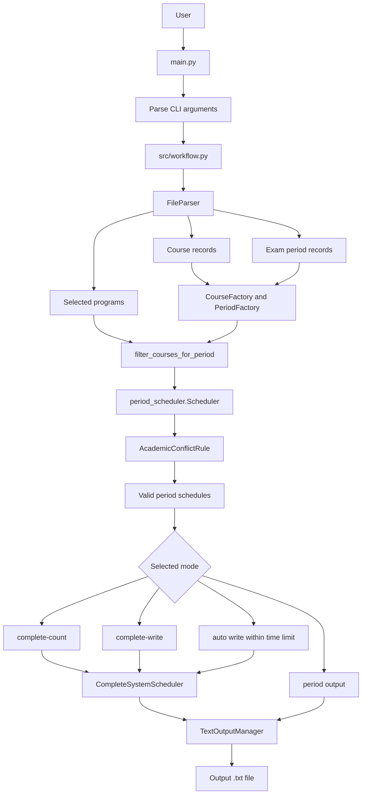
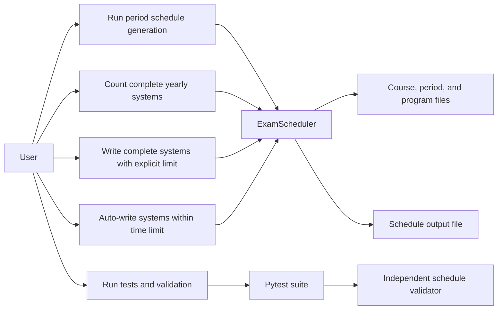
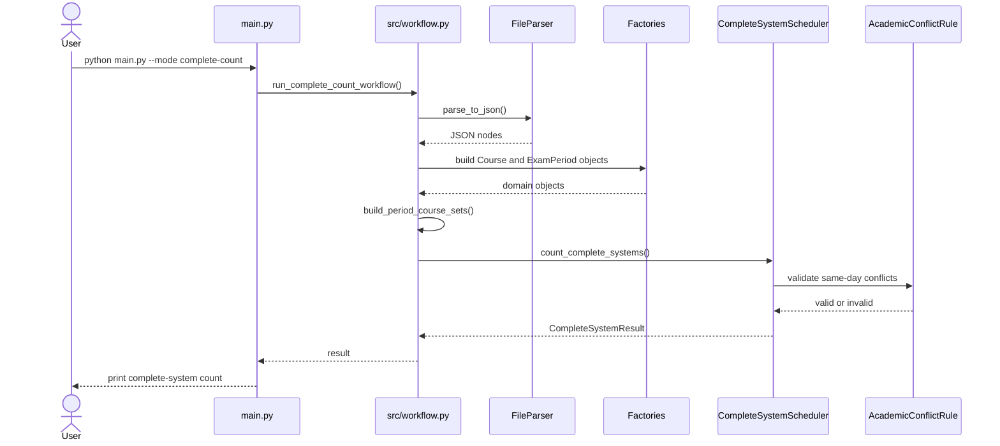
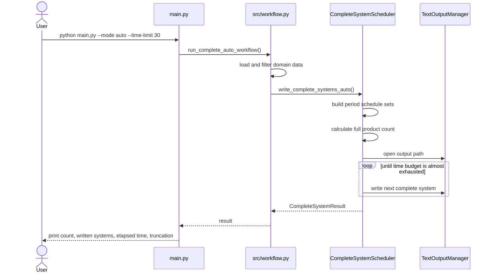
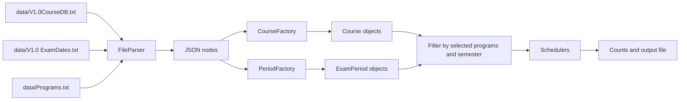

# Diagrams

These diagrams match the current project structure and file names.

Exported image and PDF versions are available in:

```text
docs/diagram_exports/
```

## System Workflow



## Use-Case Diagram



## Class Diagram

```mermaid
classDiagram
    class FileParser {
        +parse_to_json(config) str
    }

    class BaseFactory {
        +build_all(json_str, node_key) list
        _build_one(item_dict)
    }

    class CourseFactory {
        _build_one(course_dict) Course
    }

    class PeriodFactory {
        _build_one(period_dict) ExamPeriod
    }

    class Course {
        +int course_id
        +str name
        +str instructor
        +Evaluation evaluation
        +list affiliations
        +needs_exam_slot() bool
    }

    class ProgramAffiliation {
        +int program_id
        +int year
        +Semester semester
        +RequirementType requirement_type
    }

    class ExamPeriod {
        +Semester semester
        +Term term
        +date start_date
        +date end_date
        +list exclusions
        +is_date_valid(check_date) bool
    }

    class DateExclusion {
        +date start_date
        +date end_date
        +is_date_excluded(check_date) bool
    }

    class AcademicConflictRule {
        +is_valid(attempt_state) bool
    }

    class PeriodScheduler {
        +run_to_output(courses, period, output_manager) int
    }

    class CompleteSystemScheduler {
        +count_complete_systems(period_course_sets) CompleteSystemResult
        +write_complete_systems(period_course_sets, output_manager, max_systems) CompleteSystemResult
        +write_complete_systems_auto(period_course_sets, output_manager, time_limit_seconds) CompleteSystemResult
    }

    class TextOutputManager {
        +get_full_path() Path
        +export(structured_data) str
    }

    class CompleteSystemResult {
        +Path output_path
        +list period_course_counts
        +list period_schedule_counts
        +int complete_system_count
        +int written_system_count
        +float elapsed_seconds
        +bool truncated
    }

    BaseFactory <|-- CourseFactory
    BaseFactory <|-- PeriodFactory
    Course "1" --> "*" ProgramAffiliation
    ExamPeriod "1" --> "*" DateExclusion
    PeriodScheduler --> AcademicConflictRule
    CompleteSystemScheduler --> AcademicConflictRule
    PeriodScheduler --> TextOutputManager
    CompleteSystemScheduler --> TextOutputManager
    CompleteSystemScheduler --> CompleteSystemResult
```



## Sequence: Complete Count Mode



## Sequence: Auto Mode



## Data Flow


